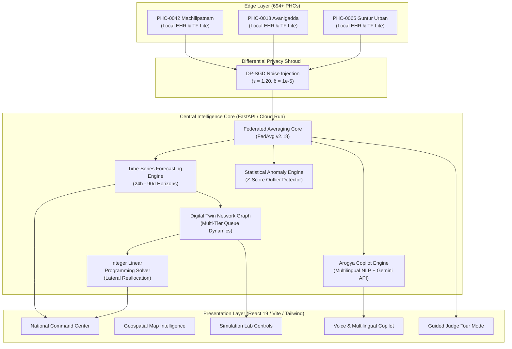

# SYSTEM ARCHITECTURE & TOPOLOGY
### AROGYAGRID AI: Federated Intelligence for Resilient Public Healthcare

---

## 1. Architectural Philosophy
ArogyaGrid AI is built on the tenet of **Edge-Centric Resilience with Centralized Optimization**:
1. **Decentralized Data Ownership**: Frontline health centres retain sovereign custody of citizen health records.
2. **Asymmetric Parameter Federation**: Local nodes send only lightweight gradient tensors $(\nabla_\theta L)$ to the central orchestrator.
3. **Multi-Echelon Supply Chain Graph**: Logistics nodes are represented as weighted digraphs $G = (V, E)$ where nodes $V$ represent storage capacity and edges $E$ model road transit resistance and flood risk.

---

## 2. Component Diagram

---

## 3. Data Flow Pipelines

### A. Real-Time Telemetry Loop
1. PHCs log medication dispensations, bed admissions, and staff attendance.
2. Background WebSocket channels at `/ws/telemetry` stream live heartbeats and footfall adjustments to client dashboards every 4 seconds.
3. Dashboards dynamically render counter updates without page refreshes.

### B. Federated Aggregation Cycle
1. Participating PHC nodes initialize local training rounds on local outpatient arrival distributions.
2. Local gradients are clipped to $L_2$ norm $C$ and perturbed with calibrated Gaussian noise:
   $$\tilde{g} = \frac{1}{|B|} \left( \sum_{i \in B} \text{clip}(g_i, C) + \mathcal{N}(0, \sigma^2 C^2 I) \right)$$
3. The central server computes weighted model averages:
   $$W_{t+1} = \sum_{k=1}^K \frac{n_k}{n} W_{t+1}^k$$
4. Global model weights are broadcast back to edge clients, ensuring zero clinical patient records leave local devices.

### C. Lateral Redistribution Solver
1. Shortage detector identifies districts with:
   $$\text{Days of Stock} = \frac{\text{Current Stock}}{\max(\text{Daily Draw}, \text{Predicted Demand})} < \text{Lead Time} + 1$$
2. The Integer Linear Programming (ILP) algorithm solves for optimal flow:
   $$\min \sum_{i,j} d_{ij} \cdot t_{ij} \cdot x_{ij} \quad \text{subject to} \quad \text{Buffer}_i \ge \text{Safety Threshold}$$
3. Outputs source, destination, quantity, transit hours, and expected impact.
